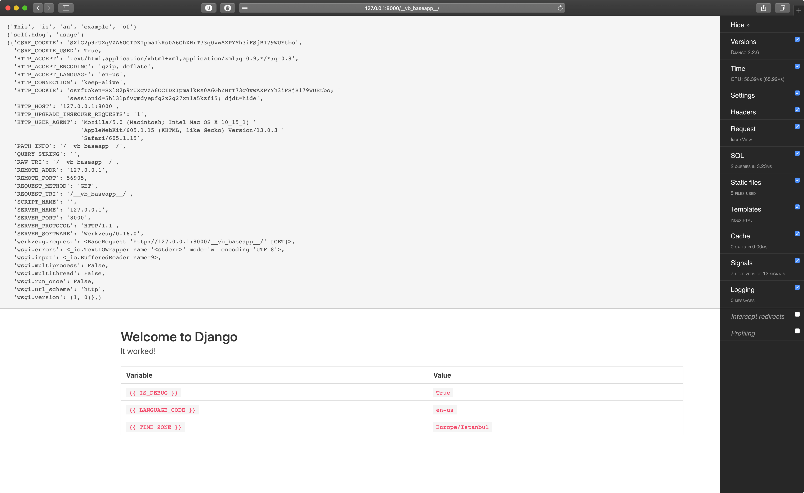

[](https://www.codacy.com/manual/vigo/django-vb-baseapp?utm_source=github.com&amp;utm_medium=referral&amp;utm_content=vbyazilim/django-vb-baseapp&amp;utm_campaign=Badge_Grade)

# django-vb-baseapp

This is a helper app for https://github.com/vbyazilim/django-vb-admin
Before you use this, you need to install `django-vb-admin`:

```bash
$ pip install django-vb-admin
```

## Features

- 2 custom base models: `BaseModel` and `BaseModelWithSoftDelete`
- 2 custom base model admins: `CustomBaseModelAdmin` and `CustomBaseModelAdminWithSoftDelete`
- Soft deletion feature for model and model admin and admin actions
- `pre_undelete` and `post_undelete` signals for soft delete operation
- Pre enabled models admin site: `ContentTypeAdmin`, `LogEntryAdmin`, `PermissionAdmin`, `UserAdmin`
- Timezone and locale middlewares
- View level on screen debug feature
- Handy utils: `numerify`, `save_file`, `SlackExceptionHandler`
- File widget for Django Admin: `AdminImageFileWidget`
- `OverwriteStorage` for overwriting file uploads
- Custom file storage for missing files for development environment: `FileNotFoundFileSystemStorage`
- Custom and configurable error page views for: `400`, `403`, `404`, `500`
- Custom management command with basic output feature `CustomBaseCommand`

---

## Models

### `BaseModel`

This is a common model. By default, `BaseModel` contains these fields:

- `created_at`
- `updated_at`
- `status`

We are overriding the default manager. `BaseModel` uses `BaseModelQuerySet` as
manager, `BaseModelWithSoftDelete` uses `BaseModelWithSoftDeleteManager`.
There are 4 basic status types:

```python
STATUS_OFFLINE = 0
STATUS_ONLINE = 1
STATUS_DELETED = 2
STATUS_DRAFT = 3
```

You can make these queries:

```python
>>> Post.objects.deleted()  # filters: status = STATUS_DELETED
>>> Post.objects.actives()  # filters: status = STATUS_ONLINE
>>> Post.objects.offlines() # filters: status = STATUS_OFFLINE
>>> Post.objects.drafts()   # filters: status = STATUS_DRAFT
```

### `BaseModelWithSoftDelete`

This model inherits from `BaseModel` and provides fake deletion which is
probably called **SOFT DELETE**. This means, when you call model’s `delete()`
method or QuerySet’s `delete()` method, it acts like delete action but never
deletes the data.

Just sets the status field to `STATUS_DELETED` and sets `deleted_at` field to
**NOW**.

This works exactly like Django’s `delete()`. Broadcasts `pre_delete` and
`post_delete` signals and returns the number of objects marked as deleted and
a dictionary with the number of deletion-marks per object type.

You can call `hard_delete()` method to delete an instance or a queryset
actually.

```python
>>> Post.objects.all()

SELECT "blog_post"."id",
       "blog_post"."created_at",
       "blog_post"."updated_at",
       "blog_post"."status",
       "blog_post"."deleted_at",
       "blog_post"."author_id",
       "blog_post"."category_id",
       "blog_post"."title",
       "blog_post"."body"
  FROM "blog_post"
 LIMIT 21

Execution time: 0.000135s [Database: default]

<BaseModelWithSoftDeleteQuerySet [<Post: Python post 1>, <Post: Python post 2>, <Post: Python post 3>]>

>>> Category.objects.all()

SELECT "blog_category"."id",
       "blog_category"."created_at",
       "blog_category"."updated_at",
       "blog_category"."status",
       "blog_category"."deleted_at",
       "blog_category"."title"
  FROM "blog_category"
 WHERE "blog_category"."deleted_at" IS NULL
 LIMIT 21

<BaseModelWithSoftDeleteQuerySet [<Category: Python>]>

>>> Category.objects.delete()
(4, {'blog.Category': 1, 'blog.Post': 3})

>>> Category.objects.all()
<BaseModelWithSoftDeleteQuerySet []>       # rows are still there! don’t panic!

>>> Category.objects.deleted()
<BaseModelWithSoftDeleteQuerySet [<Category: Python>]>
```

`BaseModelWithSoftDeleteQuerySet` has these query options according to
`status` field:

- `.all()`
- `.offlines()` : filters if `BaseModel.STATUS_OFFLINE` is set
- `.actives()` : filters if `BaseModel.STATUS_ONLINE` is set
- `.deleted()` : filters if `BaseModel.STATUS_DELETED` is set and `deleted_at` is not `NULL`
- `.drafts()` : filters if `BaseModel.STATUS_DRAFT` is set
- `.delete()` : soft delete on given object.
- `.undelete()` : recover soft deleted on given object.
- `.hard_delete()` : this is real delete. this method erases given object.


When soft-delete enabled (*during model creation*), Django admin will
automatically use `CustomBaseModelAdminWithSoftDelete` which is inherited from:
 `CustomBaseModelAdmin` <- `admin.ModelAdmin`.

---

## Model Admins

### `CustomBaseModelAdmin`, `CustomBaseModelAdminWithSoftDelete`

Inherits from `admin.ModelAdmin`. By default, adds `status` to `list_filter`.
You can disable this via setting `sticky_list_filter = None`. When model is
created with `rake new:model...` or from management command, admin file is
automatically generated. 

Example for `Post` model admin.

```python
import logging

from django.contrib import admin

from baseapp.admin import CustomBaseModelAdminWithSoftDelete
from baseapp.utils import console

from ..models import Post

__all__ = ['PostAdmin']

logger = logging.getLogger('app')
console = console(source=__name__)

@admin.register(Post)
class PostAdmin(CustomBaseModelAdminWithSoftDelete):
    # sticky_list_filter = None
    # hide_deleted_at = False
    pass
```

By default, `deleted_at` excluded from admin form like `created_at` and
`updated_at` fields. You can also override this via `hide_deleted_at` attribute.
Comment/Uncomment lines according to your needs! This works only in `CustomBaseModelAdminWithSoftDelete`.

`CustomBaseModelAdminWithSoftDelete` also comes with special admin action. You can
recover/make active (*undelete*) multiple objects like deleting items.

---

## MiddleWare

### `CustomLocaleMiddleware`

This is mostly used for our custom projects. Injects `LANGUAGE_CODE` variable to
`request` object. `/en/path/to/page/` sets `request.LANGUAGE_CODE` to `en` otherwise `tr`.

```python
# add this to your settings/base.py
MIDDLEWARE += ['baseapp.middlewares.CustomLocaleMiddleware']
```

---

## Custom Error Pages

You have browsable (only in development mode) and customizable error handler
functions and html templates now!. Templates are under `templates/custom_errors/`
folder.

---

## Goodies

### `HtmlDebugMixin`



`self.hdbg(arg, arg, arg, ...)` method helps you to output/debug some data
in view layer.

```python
# example view: index.py

from django.views.generic import TemplateView

from console import console

from ..mixins import HtmlDebugMixin
from ..utils import numerify

__all__ = ['IndexView']

console = console(source=__name__)


class IndexView(HtmlDebugMixin, TemplateView):
    template_name = 'index.html'

    def get_context_data(self, **kwargs):
        self.hdbg('This', 'is', 'an', 'example', 'of')
        self.hdbg('self.hdbg', 'usage')
        self.hdbg(self.request.META)
        kwargs = super().get_context_data(**kwargs)

        query_string_p = numerify(self.request.GET.get('p'))
        console(query_string_p, type(query_string_p))
        console.dir(self.request.user)
        return kwargs
```

`` tag added by default in to your `templates/base.html` and works
only if the `DEBUG` is `True`.

```django


<!DOCTYPE html>
<html>
<head>
    <meta charset="utf-8">
    <meta name="viewport" content="width=device-width, initial-scale=1">
    <title></title>
    
    <link rel="stylesheet" href="">
    <script defer src=""></script>
    
    <link rel="stylesheet" href="https://cdn.jsdelivr.net/npm/bulma@0.8.0/css/bulma.min.css">
    <script defer src="https://use.fontawesome.com/releases/v5.3.1/js/all.js"></script>
    
    <link rel="stylesheet" href="">
    <link rel="stylesheet" href="">
    
    <script defer src=""></script>
</head>
<body>
    
    
    
</body>
</html>
```

If you don’t want to extend from `templates/base.html` you can use your
own template. You just need to add `` tag in to your template.


---

## License

This project is licensed under MIT

---

## Contributer(s)

* [Uğur "vigo" Özyılmazel](https://github.com/vigo) - Creator, maintainer

---

## Contribute

All PR’s are welcome!

1. `fork` (https://github.com/vbyazilim/django-vb-baseapp/fork)
1. Create your `branch` (`git checkout -b my-features`)
1. `commit` yours (`git commit -am 'Add killer features'`)
1. `push` your `branch` (`git push origin my-features`)
1. Than create a new **Pull Request**!

---

## Change Log

**2019-08-07**

- Initial Beta relase: 1.0.0

---
